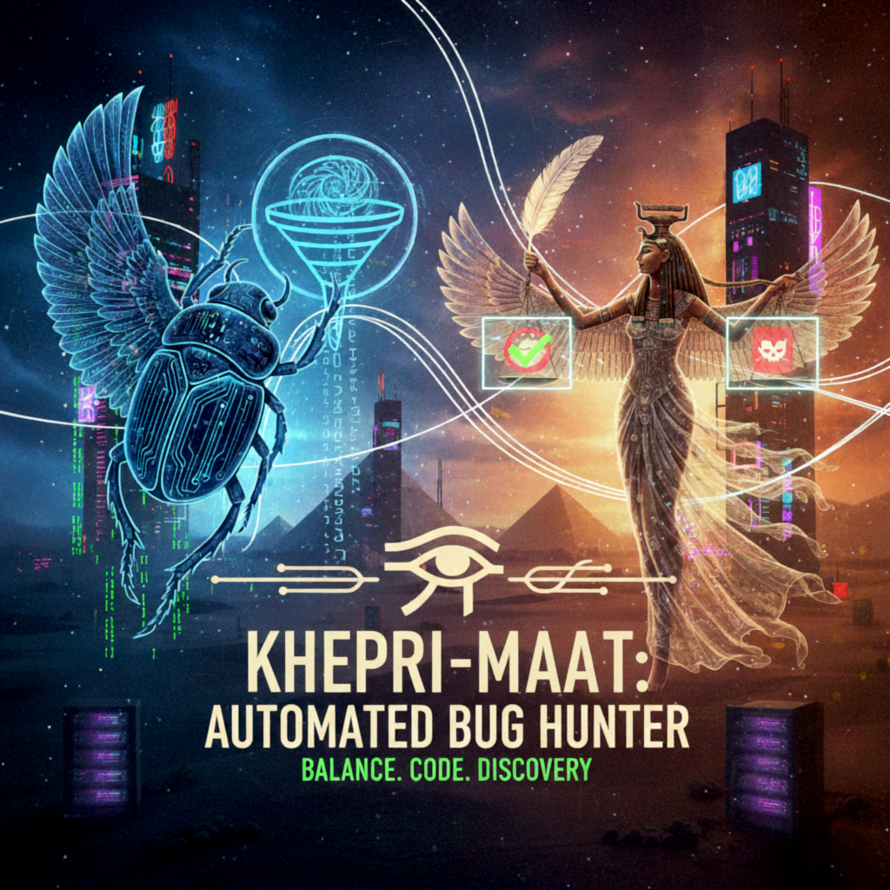

# 🦂⚖️ KhepriMaat — Offensive Recon & Vuln Automation  
     


> Key Hunting & Exploration Platform for Reconnaissance Intelligence. Built for fast, scoped, auditable bug bounty automation.

## About KhepriMaat
KhepriMaat blends continual transformation (Khepri) with balance and truth (Maat). It was born to give our red-team lab a reproducible, evidence-first pipeline for recon, probing, and verification—without losing auditability. Every subsystem (control API, parsers, reporting, notifications) keeps findings explainable, replayable, and safe to validate in the lab before they ever touch production.



**Why it exists**
- Replace brittle one-off scripts with a cohesive, testable automation spine.
- Preserve ground truth: store requests/responses, confidence, and provenance per finding.
- Enable remote control: bearer-protected API + rate limits + SSE events for live status.
- Stay tool-agnostic: wrap subfinder/httpx/nuclei/sqlmap/ffuf with structured parsers and confidence scoring.

**How it’s built (lab view)**
- Rust async stack (Tokio, Axum, SQLx AnyPool for SQLite/Postgres).
- Evidence-first parsers with truncation and export-safe reporting (HTML/JSON/CSV).
- Notification fan-out (SMTP, Slack/Discord/webhooks) with optional XOAUTH2.
- CI: fmt + clippy + tests + coverage; fixtures for parsers and SMTP config.

**Control surface (today)**
- CLI & control API server (Bearer + rate limits).
- Endpoints: POST /scans, GET /scans, GET /scans/:id/findings, status, cancel, SSE /events.
- Defaults scoped to local lab: bind 127.0.0.1, token required, sqlite://data/kheprimaat.db.

**Road ahead**
- Worker/queue for scans with live progress push.
- Secret-aware redaction in stored evidence.
- Container/packaging for isolated lab deploys.

## ⚡ Why KhepriMaat
- End-to-end pipeline: Subfinder → HTTPX → Nuclei → SQLMap/FFUF.
- Hard scope enforcement + rate limits; fails soft, logs everything.
- Dedup + confidence scoring to cut noise; JSON/HTML reports ready to ship.
- SQLite by default; Postgres-ready via `DATABASE_URL`.
- Proprietary. Exclusive use by ind4skylivey.

## 🚀 Quick Start (5-minute lab spin-up)
```bash
cd /media/il1v3y/HD2/HDfiles/shenanigans/Repos/Personal/kheprimaat
mkdir -p data reports logs
cargo build
# initialize DB + defaults
cargo run -- --database-url sqlite://data/kheprimaat.db db-init
# add a target
cargo run -- target-add example.com --scope "*.api.example.com,app.example.com"
# launch the control API (bearer token)
cargo run -- server --bind 127.0.0.1:8080 --token mytoken
# trigger a scan via CLI or API
cargo run -- scan-start example.com --config templates/config/default-scan.yaml
curl -H "Authorization: Bearer mytoken" -H "Content-Type: application/json" \
  -d '{"target":"example.com"}' http://127.0.0.1:8080/scans
# inspect findings
cargo run -- findings-list
```

## 🧩 Commands (CLI surface)
- `server --bind <addr> --token <token>` start control API
- `target-add|list|show|delete`
- `scan-start|list|status|cancel`
- `findings-list|verify|export|report`
- `config-webhook|config-slack|config-discord|config-create`
- `db-init`

## 🛠️ Stack (at a glance)
- Rust 2021 async: Tokio, Axum, Tower HTTP, Clap
- SQLx AnyPool (SQLite/Postgres), UUID/chrono
- HTTP: Reqwest/Hyper; Templates/Reports: Handlebars/CSV/JSON
- Notifications: Lettre (SMTP LOGIN/PLAIN/XOAUTH2), Slack/Discord/Webhooks
- CI: fmt + clippy + tests + coverage fixtures

## 🔐 Safety Defaults
- Scope validation before tool runs; rate limits per API token/IP
- Bearer-protected control API bound to 127.0.0.1 by default
- Timeouts + soft-fail paths in adapters; dedup + confidence scoring
- Evidence persisted (requests/responses) and exported to reports

## 📂 Layout
- `src/` core (models, orchestrator, tools, DB, reporting, notifications, control API)
- `templates/config/` scan profiles (`default-scan.yaml`)
- `tests/` fixtures for parsers/SMTP/cancellation
- `assets/` branding (banner, logo, about)

## ▶️ Roadmap (concise)
1) Queue/worker for scans + live progress (SSE/push).  
2) Secret-aware redaction across stored evidence.  
3) Packaging: container image + lab bootstrap.  
4) Red-team UX: richer reports, timeline view, and webhook templating.
